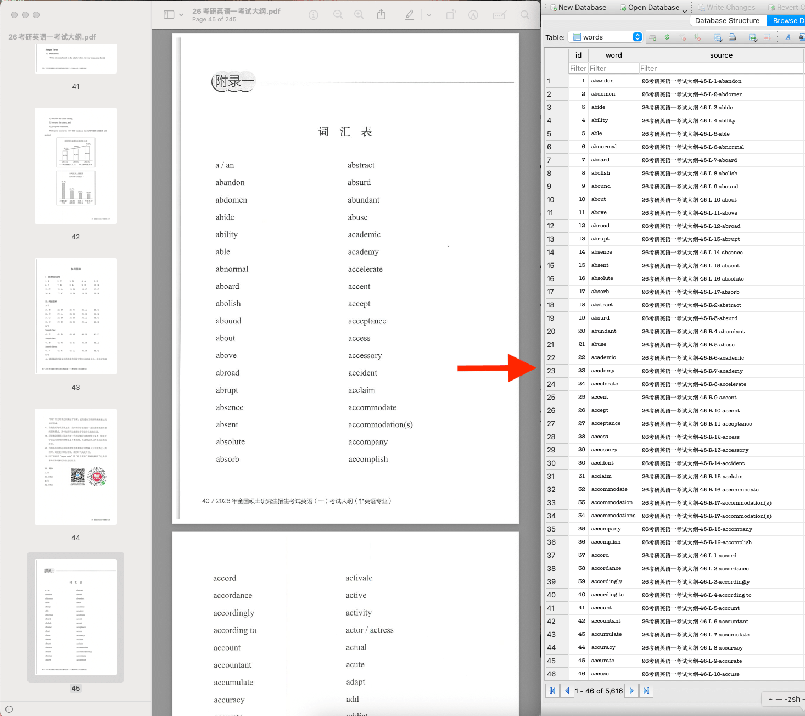
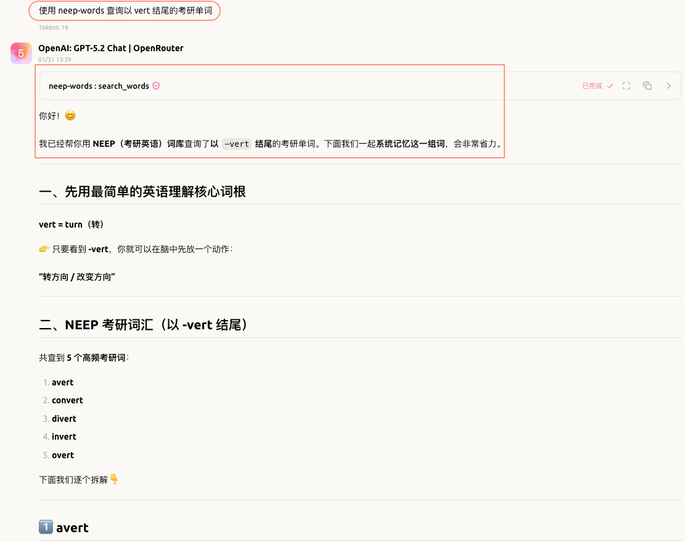

# NeepWords

一个用于从扫描版考研英语《考试大纲》 PDF 中提取词汇的 Python OCR 工具，并内置 MCP server 供 AI 助手安全、只读地查询本地词库，针对 macOS Apple Silicon 优化。其中 `resources/data/` 下的文件为从 PDF 提取出的 5600 个左右的单词。

## 目录

- [提取词汇 CLI](#提取词汇-cli)
  - [提取词汇（主命令）](#提取词汇主命令)
  - [添加词汇（add-words）](#添加词汇add-words)
  - [导出词表（export-csv）](#导出词表export-csv)
  - [原理与流程](#原理与流程)
- [MCP Server](#mcp-server)
- [技术栈](#技术栈)

## 提取词汇 CLI



### 提取词汇（主命令）

```bash
uv sync
uv run word_extractor --pdf resources/pdfs/26考研英语一考试大纲.pdf \
  --start-page 45 \
  --end-page 165 \
  --spellcheck-language en_GB \
  --spellcheck-language en \
  --split-offset -0.1
```

说明：`uv sync` 会安装项目命令入口（`word_extractor`）。

CLI 输入的页码为 1-based（从 1 开始）。

拼写检查示例：

```bash
# 关闭 Cocoa 拼写检查
uv run word_extractor --pdf resources/pdfs/26考研英语一考试大纲.pdf \
  --start-page 146 \
  --end-page 147 \
  --no-spellcheck

# 拼写检查未通过也写入数据库
uv run word_extractor --pdf resources/pdfs/26考研英语一考试大纲.pdf \
  --start-page 146 \
  --end-page 147 \
  --spellcheck-rejected db
```

调试输出：

```bash
uv run word_extractor --pdf resources/pdfs/26考研英语一考试大纲.pdf \
  --start-page 45 \
  --end-page 45 \
  --spellcheck-language en_GB \
  --spellcheck-language en \
  --split-offset -0.1  \
  --debug-dir debug
```

参数（主命令）：

- `--pdf`：输入 PDF 路径（必填）
- `--start-page`：起始页码，1-based（必填）
- `--end-page`：结束页码，1-based（必填）
- `--output-dir`：输出目录（默认 `output`）
- `--debug-dir`：调试输出目录（可选，保存裁剪/分栏等中间图像），例如`--debug-dir debug`
- `--spellcheck` / `--no-spellcheck`：是否启用 Cocoa 拼写检查（默认启用）
- `--spellcheck-rejected`：拼写检查未通过单词的去向（`csv` 或 `db`，默认 `csv`）
- `--spellcheck-language`：拼写检查语言（可重复，默认 `en`）
- `--split-offset`（`--split-offse`）：双栏分割偏移（默认 `0.0`，相对页宽的比例）

### 添加词汇（add-words）

用于复核 rejected_words.csv 后手动入库：

```bash
uv run word_extractor add-words \
  --entry "endeavour:26考研英语一考试大纲-81-L-2-endeavour" \
  --entry "favourite:26考研英语一考试大纲-86-L-8-favourite" \
  --entry "humourous:26考研英语一考试大纲-97-R-4-humo(u)rous" \
  --entry "policewoman:26考研英语一考试大纲-125-L-3-policeman / policewoman"
```

说明：`--entry` 支持 `word[:source]`，source 可省略。

参数（add-words）：

- `--entry`：词条 `word[:source]`（可重复）
- `--db-path`：指定 `words.sqlite3` 路径（默认 `output/words.sqlite3`）

### 导出词表（export-csv）

```bash
uv run word_extractor export-csv --csv-path output/2026-01-26.csv --columns word --db-path output/words.sqlite3
uv run word_extractor export-csv --csv-path output/2026-01-26-source.csv --columns word,source --db-path output/words.sqlite3
```

说明：默认导出路径为 `output/YYYY-MM-DD.csv`，默认导出列为 `word,source`。

参数（export-csv）：

- `--db-path`：指定导出的 `words.sqlite3` 路径（默认 `output/words.sqlite3`）
- `--csv-path`：指定导出的 CSV 路径（默认 `output/YYYY-MM-DD.csv`）
- `--columns`：指定导出列（默认 `word,source`，逗号分隔）

### 原理与流程

整体流程基于“渲染 -> 图像处理 -> OCR -> 规范化/扩展 -> 拼写检查 -> 入库/导出”的流水线：

1. PDF 页面渲染为高分辨率图像（pypdfium2）。
2. 图像裁剪去除页眉/页脚，并进行对比度/二值化等增强处理（PIL）。
3. 对双栏页面进行左右分栏，逐栏调用 OCR（ocrmac / Apple Vision）。
4. OCR 文本清洗与规范化，词形扩展（例如大小写/标点处理等）。
5. Cocoa 拼写检查：通过的词进入数据库；未通过的词写入 `rejected_words.csv` 或按配置写入数据库。
6. 写入 `words.sqlite3`，按 `norm` 去重并累计 `frequency`。

## MCP Server

本项目提供 MCP server（`neep_mcp`），用于只读查询 `resources/data/words.sqlite3` 中的词库数据，便于 AI 助手在本地获取权威词表信息。



### Tools

- `lookup_words`：批量精确查询，支持 `match=word|norm|auto`。
- `search_words`：模糊搜索（默认 `mode=contains`），结果仅返回 `word`。支持 `prefix` / `suffix` / `contains` / `fuzzy` / `wildcard`。
  - `prefix`：词首匹配
  - `suffix`：词尾匹配
  - `contains`：词中包含
  - `fuzzy`：字符序列匹配（按顺序出现即可）
  - `wildcard`：SQL LIKE 风格通配符（`%` 任意长度，`_` 单字符）
- `get_random_words`：随机获取词汇，可选 `min_frequency` 过滤。

启动：

```bash
uv run python -m neep_mcp.server
```

可选环境变量（指定数据库路径）：

```bash
NEEP_WORDS_DB_PATH=/path/to/words.sqlite3
```

mcp 配置：

```json
{
  "mcpServers": {
    "neep-words": {
      "command": "uv",
      "args": [
        "run",
        "--project",
        "<ProjectPath>",
        "python",
        "-m",
        "neep_mcp.server"
      ],
      "env": {
        "NEEP_WORDS_DB_PATH": "<ProjectPath>/resources/data/words.sqlite3"
      }
    }
  }
}
```

## 技术栈

- PDF 渲染：pypdfium2
- 图像处理：PIL (Pillow)
- OCR 引擎：ocrmac (Apple Vision)
- MCP Server：FastMCP (mcp)
