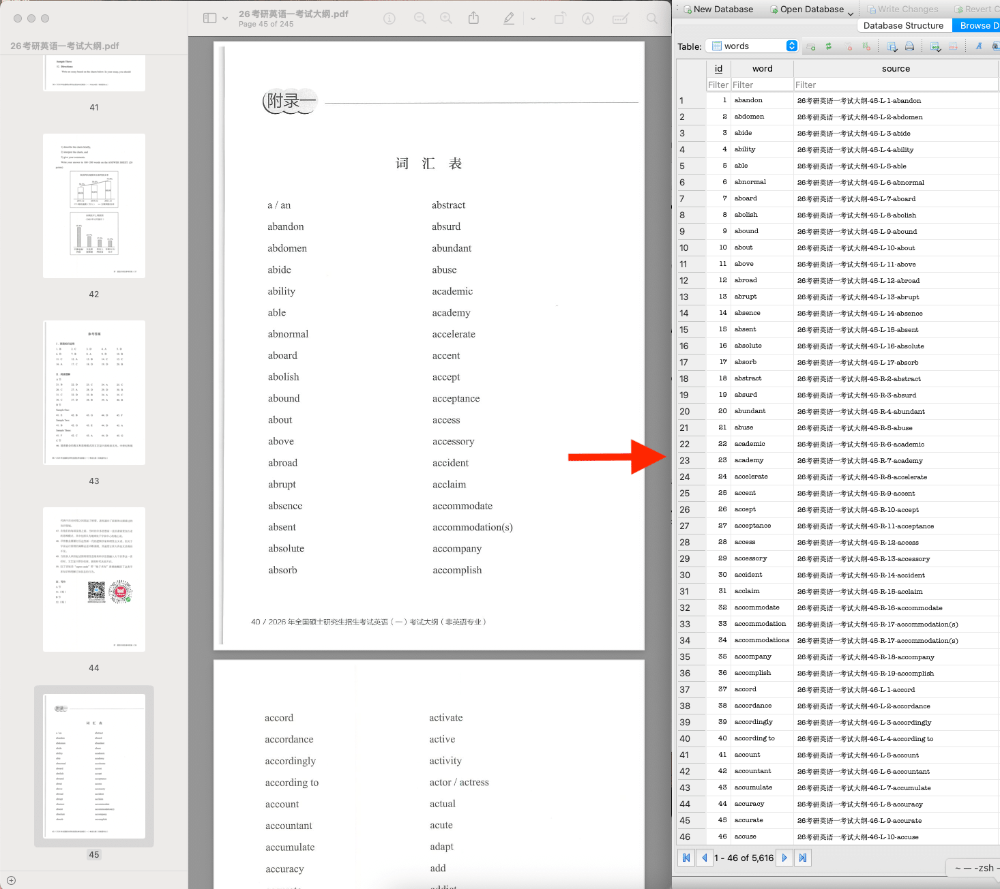
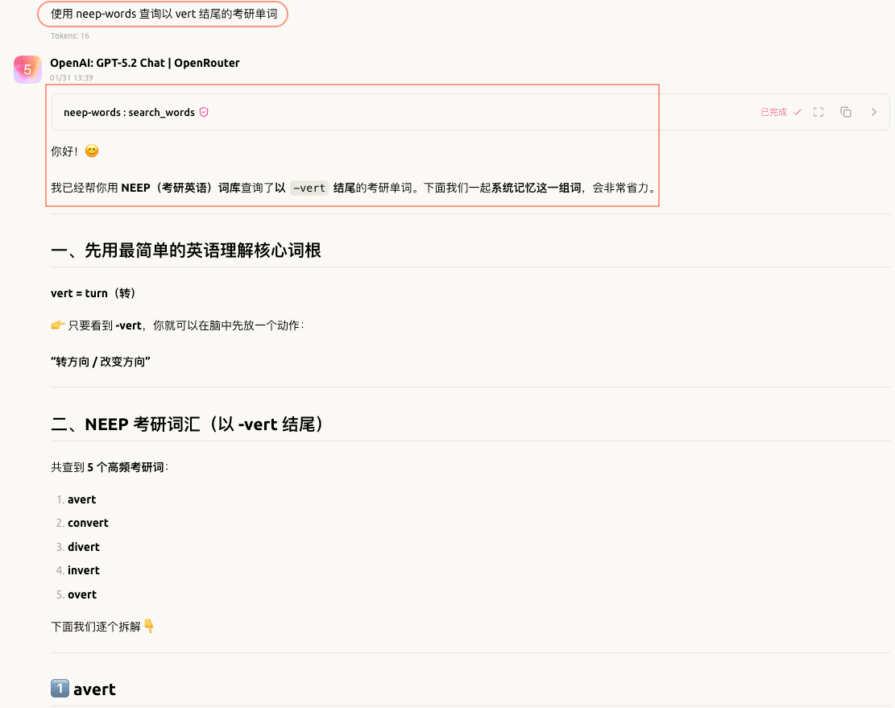

# NeepWords

一个用于从扫描版考研英语《考试大纲》PDF 中提取词汇的 Python OCR 工具，并内置 MCP server 与本地 skill 供 AI 助手查询词库，针对 macOS Apple Silicon 优化。

项目现在支持“单库多版本”词表管理：同一个 SQLite 可以同时存放 `2026`、`2027`、`2028` 等多个考研版本。

## 目录

- [提取词汇 CLI](#提取词汇-cli)
  - [提取词汇（主命令）](#提取词汇主命令)
  - [添加词汇（add-words）](#添加词汇add-words)
  - [导出词表（export-csv）](#导出词表export-csv)
  - [迁移与版本管理](#迁移与版本管理)
  - [原理与流程](#原理与流程)
- [MCP Server](#mcp-server)
- [Agent Skill](#agent-skill)
- [技术栈](#技术栈)

## 提取词汇 CLI



### 提取词汇（主命令）

```bash
uv sync
uv run word_extractor --pdf resources/pdfs/26考研英语一考试大纲.pdf \
  --start-page 45 \
  --end-page 165 \
  --version 2026 \
  --spellcheck-language en_GB \
  --spellcheck-language en \
  --split-offset -0.1
```

说明：

- `uv sync` 会安装项目命令入口 `word_extractor`
- CLI 页码为 1-based
- `--version` 必填，支持 `2026`、`26`、`2026考研` 这类写法
- 提取命令默认将数据库写入 `output/words.sqlite3`

拼写检查示例：

```bash
uv run word_extractor --pdf resources/pdfs/26考研英语一考试大纲.pdf \
  --start-page 146 \
  --end-page 147 \
  --version 2026 \
  --no-spellcheck
```

调试输出：

```bash
uv run word_extractor --pdf resources/pdfs/26考研英语一考试大纲.pdf \
  --start-page 45 \
  --end-page 45 \
  --version 2026 \
  --spellcheck-language en_GB \
  --spellcheck-language en \
  --split-offset -0.1 \
  --debug-dir debug
```

参数：

- `--pdf`：输入 PDF 路径
- `--start-page`：起始页码，1-based
- `--end-page`：结束页码，1-based
- `--version`：导入目标版本，必填
- `--legacy-version`：当目标库还是旧单版本 schema 时，声明库中旧数据所属版本
- `--output-dir`：输出目录，默认 `output`
- `--debug-dir`：调试输出目录
- `--spellcheck` / `--no-spellcheck`：是否启用 Cocoa 拼写检查
- `--spellcheck-rejected`：拼写检查失败词写到 `csv` 或 `db`
- `--spellcheck-language`：拼写检查语言，可重复
- `--split-offset`：双栏分割偏移

数据库路径约定：

- `output/words.sqlite3`：用户实际工作库，提取命令默认写入这里
- `resources/examples/words.sqlite3`：仓库可附带的只读示例库，仅用于开箱即用查询演示

### 添加词汇（add-words）

用于复核 `rejected_words.csv` 后手动入库：

```bash
uv run word_extractor add-words \
  --db-path output/words.sqlite3 \
  --version 2026 \
  --entry "endeavour:26考研英语一考试大纲-81-L-2-endeavour" \
  --entry "favourite:26考研英语一考试大纲-86-L-8-favourite" \
  --entry "humourous:26考研英语一考试大纲-97-R-4-humo(u)rous" \
  --entry "gasolene:26考研英语一考试大纲-123-L-6-petrol / gasoline / gasolene" \
  --entry "policewoman:26考研英语一考试大纲-125-L-3-policeman / policewoman"
```

参数：

- `--entry`：词条 `word[:source]`，可重复
- `--db-path`：目标数据库路径
- `--version`：写入目标版本，必填
- `--legacy-version`：自动升级旧库时声明旧数据版本

### 导出词表（export-csv）

```bash
uv run word_extractor export-csv \
  --db-path output/words.sqlite3 \
  --csv-path output/2027.csv \
  --columns version,word,source \
  --version 2027
```

参数：

- `--db-path`：导出数据库路径
- `--csv-path`：CSV 输出路径，默认 `words/YYYY-MM-DD.csv`
- `--columns`：导出列，默认 `word,source`
- `--version`：按指定版本过滤导出

### 迁移与版本管理

旧单版本库迁移：

```bash
uv run word_extractor migrate-db --db-path output/words.sqlite3 --legacy-version 2026
```

查看库中版本：

```bash
uv run word_extractor list-versions --db-path output/words.sqlite3
```

切换数据库默认版本：

```bash
uv run word_extractor set-default-version --db-path output/words.sqlite3 --version 2027
```

未显式指定版本时，解析顺序为：

1. 显式参数
2. 环境变量 `NEEP_WORDS_VERSION`
3. `neep.toml` 中 `[words].default_version`
4. 数据库默认版本
5. 数据库唯一版本

### 原理与流程

整体流程基于“渲染 -> 图像处理 -> OCR -> 规范化/扩展 -> 拼写检查 -> 入库/导出”的流水线：

1. PDF 页面渲染为高分辨率图像
2. 图像裁剪去除页眉页脚，并进行增强处理
3. 对双栏页面进行左右分栏并逐栏 OCR
4. OCR 文本清洗、规范化和词形扩展
5. Cocoa 拼写检查：通过的词进入数据库；未通过的词写入 `rejected_words.csv` 或按配置写入数据库
6. 写入 `words.sqlite3`，按 `(version_id, word)` 唯一入库，并记录 `added_at`

## MCP Server

本项目提供只读 MCP server `neep_mcp`，用于查询本地词库。



### Tools

- `lookup_words`：批量精确查询，支持 `match=word|auto` 和 `version`
- `search_words`：模糊搜索，支持 `prefix` / `suffix` / `contains` / `fuzzy` / `wildcard`
- `list_versions`：列出数据库中的版本、词数和默认版本

启动：

```bash
uv run python -m neep_mcp.server
```

可选环境变量：

```bash
NEEP_WORDS_DB_PATH=/path/to/words.sqlite3
NEEP_WORDS_VERSION=2027
```

默认数据库解析顺序：

1. `--db-path` 或 MCP 客户端显式配置
2. `NEEP_WORDS_DB_PATH`
3. `neep.toml` 中 `[words].db_path`
4. `output/words.sqlite3`
5. `resources/examples/words.sqlite3`

也就是说，查询入口会优先使用你的工作库；只有工作库不存在时，才会回退到仓库附带的示例库。

MCP 配置示例：

```json
{
  "mcpServers": {
    "neep-words": {
      "command": "uv",
      "args": [
        "run",
        "--project",
        "<ProjectPath>",
        "python",
        "-m",
        "neep_mcp.server"
      ],
      "env": {
        "NEEP_WORDS_DB_PATH": "<ProjectPath>/output/words.sqlite3",
        "NEEP_WORDS_VERSION": "2027"
      }
    }
  }
}
```

## Agent Skill

如果你在 Codex 类代理环境中使用本仓库，也可以通过内置 skill 查询和管理本地词库，而不经过 MCP：

```bash
uv run python skills/neep-vocab/scripts/neep_vocab.py lookup --json --version 2027 adaptive
uv run python skills/neep-vocab/scripts/neep_vocab.py search --json --mode prefix trans
uv run python skills/neep-vocab/scripts/neep_vocab.py list-versions --json
uv run python skills/neep-vocab/scripts/neep_vocab.py set-default-version --json --version 2027
```

- skill 目录：`skills/neep-vocab/`
- 数据库解析顺序：`--db-path` -> `NEEP_WORDS_DB_PATH` -> `neep.toml` -> `output/words.sqlite3` -> `resources/examples/words.sqlite3`
- 版本解析顺序：`--version` -> `NEEP_WORDS_VERSION` -> `neep.toml` -> 数据库默认版本 -> 唯一版本
- `set-default-version` 会修改工作数据库默认版本，影响后续未显式指定版本的查询

## 技术栈

- PDF 渲染：pypdfium2
- 图像处理：PIL (Pillow)
- OCR 引擎：ocrmac (Apple Vision)
- MCP Server：FastMCP (`mcp`)
