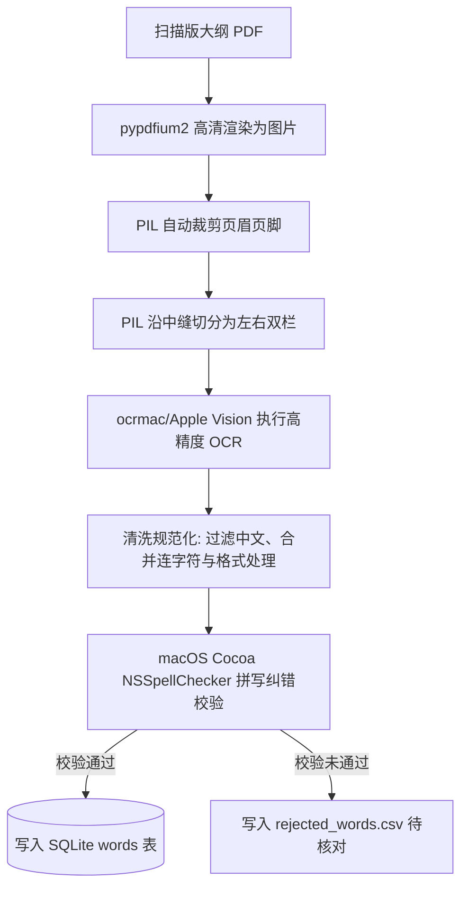

# NeepWords

<p align="center">
  
  
  
  
  
</p>

NeepWords 是一个面向考研英语词表场景的本地工具集，主要解决两件事：
1. **本地词表能力 (Skills)**：让 AI 或用户能够基于本地 SQLite 词库进行单词的检索、大纲归属判断，或将单词快速导出为方便打印与背诵的 A4 PDF / Excel 词汇表。
2. **OCR 提取与维护 (CLI)**：提供针对扫描版《考试大纲》的 OCR 双栏自动分割提取工作流，支持人工补录、CSV 灵活导出与 SQLite 词库的多版本管理。

---

## 📂 项目结构

```text
NeepWords/
├── docs/                 # 项目设计与参考文档 (数据库设计、拼写检查设计等)
├── src/
│   └── word_extractor/   # 主项目 OCR 提取与 SQLite 维护 CLI 工具
├── skills/               # 本地开箱即用小工具集 (免安装或低依赖)
│   ├── kaoyan-vocab-lookup/ # 单词检索与大纲判断服务 (内置 2026 示例词库)
│   └── kaoyan-vocab-sheet/  # 单词排版生成 A4 PDF/Excel 背诵表服务
├── tests/                # 单元测试用例
├── pyproject.toml        # 项目依赖、开发环境及 Ruff 配置
└── resources/            # 预留的输入资产与示例数据库存放处
```

---

## ⚡ 快速上手：开箱即用的本地 Skills

本项目内置了包含 2026 考研大纲词汇的示例数据库。运行本地 Skill **不需要** macOS 系统，只要系统安装了 Python `>=3.11` 和 [uv](https://github.com/astral-sh/uv) 即可。

> [!TIP]
> **没有安装 `uv`？**
> `uv` 是一个由 Rust 编写的超快 Python 包与环境管理工具。安装非常简单：
> - macOS/Linux: `curl -LsSf https://astral.sh/uv/install.sh | sh`
> - Windows: `powershell -c "irm https://astral.sh/uv/install.ps1 | iex"`

### 1. 考研词库查询与检索 (kaoyan-vocab-lookup)

用于判断单词是否在大纲词库中，支持前缀、模糊等多种检索模式。首先确保项目依赖已同步：

```bash
# 同步项目基础依赖
uv sync

# 1. 查询某个单词 (Lookup)
uv run skills/kaoyan-vocab-lookup/scripts/neep_vocab.py lookup --json transition

# 2. 前缀检索单词 (Search)
uv run skills/kaoyan-vocab-lookup/scripts/neep_vocab.py search --json --mode prefix trans

# 3. 列出当前 SQLite 支持的所有词表版本
uv run skills/kaoyan-vocab-lookup/scripts/neep_vocab.py list-versions --json
```

若你需要修改某个可写数据库的默认词表版本，可指定数据库路径运行：

```bash
uv run skills/kaoyan-vocab-lookup/scripts/neep_vocab.py set-default-version \
  --db-path output/words.sqlite3 \
  --version 2027 \
  --json
```

---

### 2. A4 背诵单词卡生成 (kaoyan-vocab-sheet)

用于把指定的单词列表生成方便打印和背诵的 A4 规格 PDF，并可根据需要附带生成 XLSX 文件。

> [!NOTE]
> 该脚本通过 [PEP 723](https://peps.python.org/pep-0723/) 声明了外部依赖。当你使用 `uv run` 时，`uv` 会自动为您提供免配置的临时隔离运行环境，**无需手动安装任何依赖**：

```bash
# 基于指定文本中的词列表，生成 A4 排版背诵 PDF
uv run skills/kaoyan-vocab-sheet/scripts/vocab_sheet.py skills/kaoyan-vocab-sheet/examples/words.txt
```

---

## 📸 进阶：OCR 提取与 SQLite 维护

本部分提供将您个人合法取得的扫描版《考试大纲》PDF 进行高保真识别并录入 SQLite 数据库的功能。

### 📌 前置条件
* **系统要求**：由于底层调用了 Apple Vision 框架，**OCR 部分目前仅支持 macOS**。
* **依赖安装**：需要同步安装 macOS 独有的系统级及 OCR 库依赖：
  ```bash
  uv sync --extra macos
  ```
* **资源准备**：出于版权保护，本仓库**不附带**原始《考试大纲》PDF 文件，请自行准备。

### ⚙️ 主提取命令
```bash
uv run neepwords \
  --pdf /path/to/outline.pdf \
  --start-page 45 \
  --end-page 165 \
  --version 2026 \
  --spellcheck-language en_GB \
  --spellcheck-language en \
  --split-offset -0.1
```

* **参数解析**：
  * `--pdf`: 扫描版大纲 PDF 的本地绝对路径。
  * `--start-page` / `--end-page`: 识别的页码区间（1-based 物理页码）。
  * `--version`: 录入词汇的版本标识（如 `2026`、`2027` 等，必填）。
  * `--spellcheck-language`: 拼写检查的语言代码（支持设置多个，如同时支持英音与美音）。
  * `--split-offset`: 左右分栏中线的偏移量微调百分比，避免切到文字。

> [!NOTE]
> **关于入口别名**：为了兼容旧版执行脚本，本程序同时保留了 `word_extractor` 别名入口（即 `uv run word_extractor ...`）。

---

### 🔄 提取工作流详解


```mermaid
graph TD
    A[扫描版大纲 PDF] --> B[pypdfium2 高清渲染为图片]
    B --> C[PIL 自动裁剪页眉页脚]
    C --> D[PIL 沿中缝切分为左右双栏]
    D --> E[ocrmac/Apple Vision 执行高精度 OCR]
    E --> F[清洗规范化: 过滤中文、合并连字符与格式处理]
    F --> G[macOS Cocoa NSSpellChecker 拼写纠错校验]
    G -->|校验通过| H[(写入 SQLite words 表)]
    G -->|校验未通过| I[写入 rejected_words.csv 待核对]
```

详细的数据库 schema 结构请阅读：[docs/database.md](docs/database.md)。

---

### 🛠️ 人工复核与数据维护

由于扫描版大纲排版复杂，OCR 可能会遗漏或误判部分特殊词汇。我们推荐以下协同流程：

1. **检查误判词**：在 `output/rejected_words.csv` 中查看被拼写检查拦截的可疑单词。当前文件包含 `word`、`reason` 和 `source` 三列；其中 `source` 内包含原始来源标记，可用于回溯页码、栏位和行号信息。
2. **人工补录**：若确认该词确实为大纲词，使用 `add-words` 子命令手动将其补录入 SQLite 库中：
   ```bash
   uv run neepwords add-words \
     --db-path output/words.sqlite3 \
     --version 2026 \
     --entry "exemplify:26考研英语一考试大纲-83-R-13-exemplify" \
     --entry "honor:26考研英语一考试大纲-96-R-7-hono(u)r"
   ```
3. **CSV 灵活导出**：
   ```bash
   uv run neepwords export-csv \
     --db-path output/words.sqlite3 \
     --csv-path output/2026_words_export.csv \
     --version 2026
   ```

---

## 🧪 开发者指南

如果您想为本项目贡献代码，请阅读 [CONTRIBUTING.md](CONTRIBUTING.md)。

### 1. 安装开发与测试依赖
```bash
uv sync --all-extras --group dev
```

### 2. 运行单元测试
```bash
uv run pytest -v
```

### 3. 代码风格与 Lint 检查
本项目使用 `ruff` 规范代码风格，并在提交前运行 lint 校验：
```bash
# 格式化与修复常见问题
uv run ruff format
uv run ruff check --fix
```

---

## ⚖️ 许可与边界
* 软件代码遵循 [MIT 许可证](LICENSE) 发布。
* 本项目仓库内内置 of 示例数据库仅供查询演示使用。如您公开或二次分发使用本项目提取的任何大纲词汇数据，请自行承担版权风险并确保在合法范围内使用。
